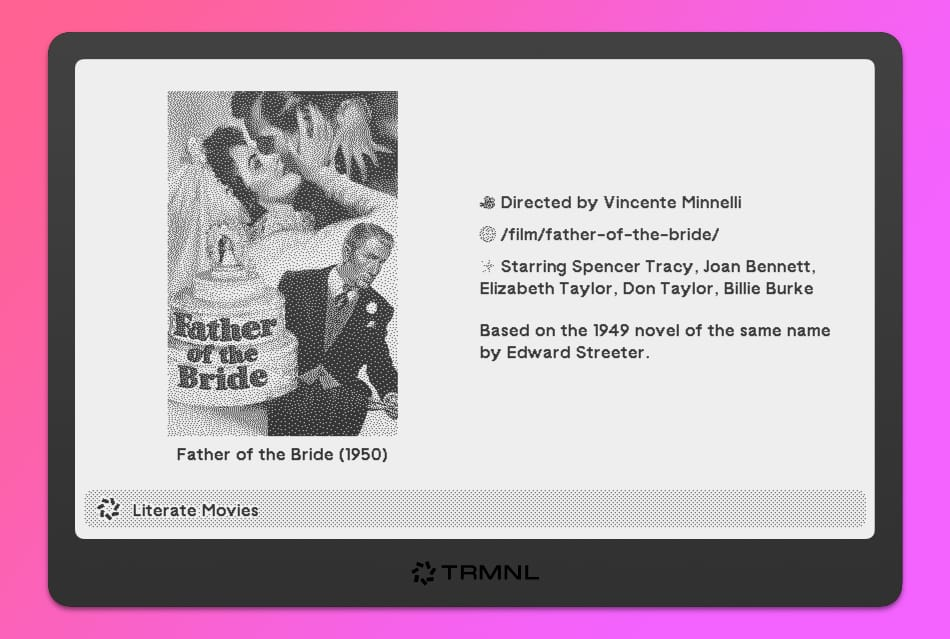

### TRMNL Literate Movies

Shows a random movie from [this list](https://letterboxd.com/shawn_stubbs/list/literate-movies/) of movies based on books, short stories, novels, novellas, poems, and other literary works.

Install plugin: [https://usetrmnl.com/recipes/122948](https://usetrmnl.com/recipes/122948)

Get $15 off with code `robb15` at checkout [https://usetrmnl.com](https://usetrmnl.com)

#### Notes 

- 1910s only has 9 movies
- 1920s only has 29 movies
- Data is from [this list on Letterboxd](https://letterboxd.com/shawn_stubbs/list/literate-movies/).

---

Removed The Haunting in Wicker Park because it doesn't have a release year.

Removed the following movies for having no director and/or actors listed:

- The Hunchback of Notre Dame / 313426
- The Hunchback of Notre Dame / 192006
- Storybook Classics: The Hunchback Of Notre Dame / 192035
- Vox Lumiere: The Hunchback of Notre Dame / 246968
- The Velveteen Rabbit / 964098
- The Velveteen Rabbit / 1095868
- Becoming Real Forever / 465465